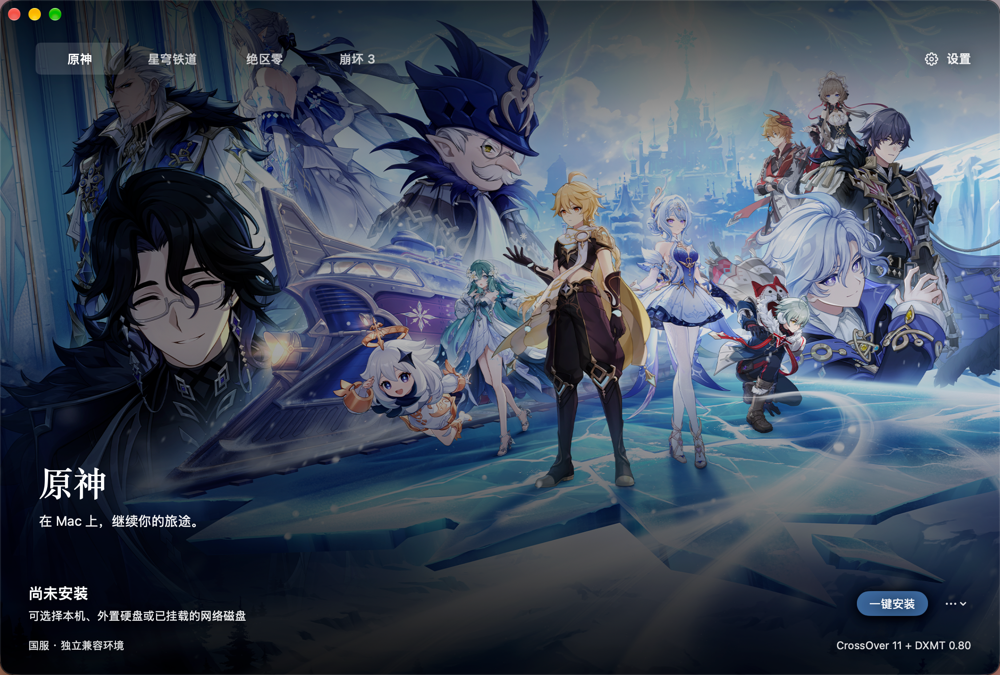

# 星桥 HoYoBridge

**让米哈游游戏在 Mac 上，拥有一个熟悉的入口。**

星桥是面向 Apple Silicon Mac 的非官方国服游戏启动器，围绕原神、崩坏：星穹铁道、绝区零和崩坏 3，提供独立安装、游戏管理和兼容环境准备。

选择想玩的游戏，确认安装位置，再从同一个界面启动。不必为了玩一款游戏，把另外三款也装进电脑。



> **尚未完成 Apple 公证**
>
> 首次打开时，macOS 可能提示“无法验证开发者”或“Apple 无法检查是否包含恶意软件”。确认从本项目下载后，请前往「系统设置 → 隐私与安全性」，点击「仍要打开」，按提示确认即可。由此带来的不便，敬请谅解。
>
> **目前仅支持国服官服，暂不支持国际服及 B 服等渠道服。**

## 特点

- **按游戏独立安装：** 四款游戏分别管理目录与任务，不捆绑下载。
- **以游戏为主的界面：** 独立封面、明确的主操作按钮、任务进度和错误说明。
- **减少环境配置：** 开发包自动准备固定兼容组件，不要求玩家安装 Docker、Python 或 Steam 客户端。
- **安装位置可控：** 提供本地推荐路径，也可选择其他目录或外置硬盘。
- **实验功能自选：** 120 FPS 解锁与 Metal HUD 默认关闭。
- **启动器更新：** 设置「应用更新」或应用菜单中检查新版，采用 Sparkle 验签后安装；游戏和安装任务运行时暂缓。当前开发包未开放正式更新源，不能视为线上自更新已验收。维护者配置见 [自更新发布说明](docs/LAUNCHER_SELF_UPDATE.md)。

星桥与米哈游、HoYoverse、Apple 或 CodeWeavers 无官方隶属或合作关系。

## 游戏支持情况

“曾经进入游戏”与“当前安装、更新、恢复流程全部验收”是不同状态。

| 游戏（国服） | 安装方式 | 当前验证范围 |
| --- | --- | --- |
| 原神 | 后台官方引擎适配器 | 已切换统一安装入口，实测官方资源查询与空间预检；新链路完整下载因本机空间不足尚未完成 |
| 崩坏：星穹铁道 | 后台官方引擎适配器 | 已有本机游玩及 PS5 蓝牙手柄用户确认；新安装适配器尚未重新完成整包验收 |
| 绝区零 | 后台官方引擎适配器 | 已有用户测试反馈；新适配器的完整安装与更新链路仍待单独验收 |
| 崩坏 3 | 后台官方引擎适配器 | 新适配器已完成完整下载、独立文件校验及暂停／重启续传测试；后续版本维护仍需验证 |

四款游戏统一接入后台官方引擎，提供检查更新、更新、校验修复、目录关联与卸载入口。崩坏 3 已通过真实卸载测试，其他游戏尚未逐款卸载验收。窗口、手柄和性能表现不能在四款游戏间相互推定。

## 系统要求

- **芯片：** Apple Silicon，当前不面向 Intel Mac。
- **系统：** 应用要求 macOS 26 或更新版本，项目适配范围为 macOS 26/27；测试版系统可能出现额外兼容问题。
- **Rosetta：** 兼容环境运行所需；应用会检查，缺失时提供安装指引。
- **空间：** 按所选游戏资源大小预检，另外需要运行环境、下载缓存和更新临时空间，不能只预留游戏最终占用。
- **网络：** 首次安装和更新需要访问官方资源服务。

当前固定组合为 **CrossOver Wine 11.0-1 + DXMT 0.80 + Steam 兼容组件**。兼容组件不是 Steam 客户端，不要求 Steam 账号。目前不支持任意替换 Wine；GPTK 不在产品提供的运行路线中。

## 安装与使用

### 获取应用

在 [GitHub Releases](https://github.com/huaye37/HoYoBridge/releases) 查看测试版本及可用附件。未公证阶段使用 **Pre-release（测试版）**，具体支持范围和已知问题以每个版本说明为准。安装包文件名如下：

```text
HoYoBridge-macOS-arm64.zip
HoYoBridge-macOS-arm64.zip.sha256
```

取得可信发行包后，在两个文件所在目录检查下载完整性：

```bash
shasum -a 256 -c HoYoBridge-macOS-arm64.zip.sha256
```

取得可信测试包后，解压并将 `HoYoBridge.app` 放入“应用程序”。SHA-256 不能替代发行者身份验证或 Apple 公证。当前开发包使用临时签名（ad-hoc）；未公证测试版首次打开可能被系统拦截。仅在确认来源可信且包未被修改后，按照 macOS「系统设置 → 隐私与安全性」提示手动确认打开。本项目不要求全局关闭系统安全功能；恶意软件或文件损坏提示不能一概当作普通未公证提示忽略。

### 安装游戏

1. 打开星桥，选择想玩的游戏。
2. 点击安装，确认推荐位置或选择其他磁盘。
3. 等待资源下载、校验和兼容环境准备完成。
4. 点击启动，在游戏内使用自己的账号登录。

四款游戏均提供“使用推荐位置”和“更改位置”选项。下载由后台官方引擎执行，不提供 YAAGL 下载入口或失败回退，应用包不再附带旧 YAAGL/Python 下载器。官方引擎窗口和 Dock 入口由后台模式隐藏；干净机器的完整无感流程仍在验证。

### 推荐安装目录

`~` 表示当前用户的个人文件夹，例如 `/Users/你的用户名`。

```text
~/Games/HoYoBridge/
├── Genshin Impact/
├── StarRail/
├── ZenlessZoneZero/
└── HonkaiImpact3/
```

只下载玩家选择的游戏。兼容环境和应用设置另存于本机应用支持目录。

- 已有安装路径不变，不因项目改名自动搬动文件。
- 外置硬盘需在安装、更新和运行期间保持连接。
- NAS 暂不推荐作为默认位置；直接运行、更新和断连恢复需要分别验收。
- 通用迁移和缓存清理尚未完成。卸载位于游戏管理菜单，会确认实际目录并永久移除游戏安装内容，无法从废纸篓恢复；请先备份目录中的个人文件。兼容环境与其他游戏保留。

## 设置与已知限制

启动设置包含窗口模式、屏幕分辨率、画面与语言选项，实际效果取决于游戏和兼容配置。

实验功能需要手动开启：

- **原神 120 FPS 解锁：** 默认关闭，目前不是四款游戏通用功能；120 是目标上限，不保证达到，可能增加负载，并带来兼容性或账号风险。
- **Metal HUD：** 显示图形运行指标，不会自动提高性能。

游戏更新可能改变资源格式和启动条件，不能保证每次更新后无需适配即可启动。出现异常应保留现有目录和日志，不建议首先删除游戏。

尚待完成的发行能力：

- 四款游戏经过真实版本更新验收的统一预下载流程。
- 启动器自更新已接入 Sparkle，但正式更新源和发布密钥未配置，真实两版本升级尚未验收；正式 GitHub 发布仍未开放。
- 所有运行组件与美术素材的公开分发许可核对。
- Developer ID 签名、公证和干净 Mac 完整安装验收。

## 问题反馈

客户端一键反馈、自动上传诊断和自动修复系统暂缓开发，目前没有接入玩家反馈服务，也不会自动将日志发送给维护者。

先查看应用的错误说明和日志入口。反馈请附上：

- Mac 芯片、内存、macOS 版本及是否为测试版系统。
- 星桥版本、游戏名称与版本、兼容组件版本。
- 问题阶段：下载、校验、环境准备、启动、登录或游戏内。
- 复现步骤、错误截图和脱敏后的相关日志片段。

**不要上传密码、验证码、登录令牌、完整账号环境或未经检查的整个日志目录。** 请通过 [Issues](https://github.com/huaye37/HoYoBridge/issues) 反馈。

## 开发与构建

项目使用 SwiftPM，要求 Swift 6.2 工具链及相应 Xcode。应用运行要求与核心包的最低编译平台声明不同。

获取源码并验证：

```bash
git clone https://github.com/huaye37/HoYoBridge.git
cd HoYoBridge
env -u PROTOC_PATH swift build
env -u PROTOC_PATH swift test
```

`SwiftProtobufPlugin` 是固定代码生成入口，请保留 `env -u PROTOC_PATH`，不要替换为未固定的系统 `protoc`。[CI 参考配置](.github/ci-reference.yml) 暂未启用：当前发布凭证没有工作流写入权限。该配置仅构建与测试，不执行发行打包，也不证明游戏可玩。

准备好打包脚本要求的固定 `LocalRuntimes` 资产后：

```bash
# 开发构建并打开应用
bash script/build_and_run.sh

# 本地优化构建，生成测试 ZIP 和 SHA-256（不是 GitHub Release，不上传）
MGB_BUILD_CONFIGURATION=release bash script/build_and_run.sh --package

# 检查 ZIP 内应用的标识、架构、签名和下载完整性
bash script/verify_release.sh --local

# 正式分发前额外检查 Gatekeeper 与公证票据
bash script/verify_release.sh --public
```

产物为 `dist/HoYoBridge.app` 和 `dist/HoYoBridge-macOS-arm64.zip`。`--public` 不会自动签名或公证，当前 ad-hoc 包不满足正式分发验收。

命令中的 `release` 只是编译优化配置，不代表发布。当前 GitHub CI 尚未启用，本机执行构建和测试。未公证版本可作为测试版发布，但应显著标注状态、保留完整性校验及第三方声明；自动更新另需配置 HTTPS 更新源、Sparkle 签名密钥并完成实际升级验证。不得将测试版标为已经公证的稳定版。

**仅克隆源码不能重现完整发行包：** `LocalRuntimes` 不入库，组件获取来源和可再分发范围仍需完善。打包脚本会关闭正在运行的星桥启动器，不会借此结束游戏进程。

对外名称为「星桥 HoYoBridge」。为兼容已有安装，Swift 包名、可执行文件、内部标识和历史数据目录仍保留 `MacGameBridge`，请勿全局替换。

## 文档与贡献

提交改动前请阅读 [项目规则](AGENTS.md)，说明影响的游戏、复现步骤及验证范围，不提交本机游戏文件、账号环境或日志。

- [参与贡献](CONTRIBUTING.md)：问题、讨论和 Pull Request 的提交方式。
- [安全策略](SECURITY.md)：安全问题的私密报告渠道。

- [当前工作上下文](docs/CURRENT_WORKING_CONTEXT.md)：最近实现和验证记录。
- [首次发行验收](docs/FIRST_RELEASE_GAPS.md)：发行前缺口与证据。
- [架构说明](docs/ARCHITECTURE.md)：模块与技术方向。
- [下载边界](docs/NETWORK_DOWNLOADS.md)、[安全解压](docs/SAFE_EXTRACTION.md)、[运行时存储](docs/RUNTIME_STORE.md)：底层实现。
- [历史开发说明](docs/README_DEVELOPMENT_HISTORY.md)：旧 README 技术记录，不作为当前兼容性承诺。

## 技术结构

- `Sources/BridgeStatus`：macOS 界面、四游戏状态、安装维护适配、兼容启动和启动器自更新。
- `Sources/BridgeCore`：资源清单、校验、存储、命令执行及底层能力；保留的清单研究代码不等于当前产品仍使用旧下载器。
- `script`：本机打包、验证及实验辅助脚本；部分脚本依赖未入库的固定本地资产。
- `Tests`：自动化测试；测试通过与游戏真实登录、游玩、版本更新验收分别记录。
- `LICENSES`、`THIRD_PARTY_NOTICES.md`：第三方许可原文及用途、来源说明。

## 借鉴项目与第三方组件

本项目不是下列项目的官方发行版。区分直接依赖、代码／资源复用和历史参考，不将第三方成果声明为本项目原创。

| 项目或来源 | 本项目中的用途 | 许可与说明 |
| --- | --- | --- |
| [YAAGL](https://github.com/yaagl/yet-another-anime-game-launcher) | 兼容启动参考、清单 schema、固定 sidecar 中的兼容资产 | 固定提交 `ca78abc29c2fc236261d088c6907d28cab6e9476`；YAAGL 自有代码为 MIT，sidecar 各组件须独立核对；已退出游戏下载主流程 |
| [anime-game-wine](https://github.com/yaagl/anime-game-wine)、[Wine](https://gitlab.winehq.org/wine/wine) / CodeWeavers | Wine 兼容环境来源与基础 | 固定 Wine CrossOver 11.0-1；不能将 Wine 源码许可等同于整个预编译包或商业 CrossOver 产品的授权 |
| [DXMT](https://github.com/3Shain/dxmt) | 图形转换，固定 0.80 | 完整预编译组件及其依赖的分发清单仍待核对 |
| [Jadeite](https://github.com/mkrsym1/jadeite) | 特定游戏启动兼容配置 | 4.1.0，MIT；不保证后续游戏版本兼容 |
| [genshin-fps-unlock](https://github.com/34736384/genshin-fps-unlock) | 原神帧率目标定位思路及衍生实现 | 参考 `netcore` 分支，MIT；不捆绑上游启动程序 |
| [Sparkle](https://github.com/sparkle-project/Sparkle) | 启动器自更新 | 2.9.6，MIT |
| [SwiftProtobuf](https://github.com/apple/swift-protobuf) | Protocol Buffers 编解码和固定代码生成 | 1.38.1，Apache-2.0 及其运行时例外；构建依赖另有许可 |
| [Zstandard](https://github.com/facebook/zstd) | 底层解压能力 | 1.5.7，采用仓库 BSD 许可文本 |
| [7-Zip](https://www.7-zip.org/) | 官方安装器解包 | 7zz 21.07，LGPL / unRAR 限制 / BSD，保留完整原文 |
| [Snap.Hutao 相关讨论](https://github.com/DGP-Studio/Snap.Hutao/issues/2446) / Lightczx | YAAGL 差分清单文件中记录的更早来源 | 间接来源，不是本项目对 Snap.Hutao 整体代码的直接依赖；原始归属注释保留，具体贡献授权仍需核对 |

具体版本、复用位置、许可原文和待核对项见 [第三方声明](THIRD_PARTY_NOTICES.md)。本表不代表所有二进制分发义务已完成。

## 非官方声明、版权与许可

项目自有代码采用 [MIT License](LICENSE)。第三方代码与运行组件遵循各自许可证，详见 [第三方声明](THIRD_PARTY_NOTICES.md)和 [许可文本](LICENSES)。MIT 不授予游戏资源、角色形象、商标或第三方二进制的额外使用权。

1. **独立、非官方项目。** 本项目与米哈游、HoYoverse、Apple、CodeWeavers 及上述开源项目不存在官方隶属、认可、赞助或合作关系；名称仅用于识别支持对象和技术来源。
2. **游戏权利不转移。** 游戏名称、角色、商标、客户端、图片、音频和其他资源归各自权利人所有。本项目的 MIT 许可证不覆盖这些内容，不提供游戏授权、账号或付费内容。
3. **美术素材单独处理。** 动态封面来自官方展示接口；仓库还含官方回退图片和以游戏角色为参考生成的图标。公开可下载、经过 AI 生成或附上致谢均不等于取得再分发授权。来源见 [背景记录](docs/LAUNCHER_ARTWORK.md) 和 [图标记录](docs/APP_ICON.md)；授权未确认的素材在公开分发前必须取得适用授权、替换或移除。
4. **官方服务并非官方集成授权。** 下载由后台官方引擎执行，使用未公开承诺稳定的本地接口；安装器按需从官方 CDN 获取，不捆绑游戏整包。这不意味着米哈游为本项目提供技术支持或批准该集成。
5. **兼容性和账号后果。** 项目按现状提供，不保证所有版本可用、性能达到特定水平或账号不会受限制。用户仍需遵守相应游戏服务条款；本项目不修改服务器数据、不篡改联机结果、不提供角色能力提升。
6. **尊重上游许可。** 复制或修改的第三方代码保留归属及许可，依赖按各自许可证处理。尤其不能以 YAAGL 的 MIT 许可替代 Wine、Steam 兼容资产和其他附带组件的各自义务。

权利人如发现归属、素材使用或许可记录有误，可通过 [Issues](https://github.com/huaye37/HoYoBridge/issues) 联系维护者并提供具体文件、权利依据和诉求；维护者核实后更正、替换或移除。**免责声明不能替代授权，也不能消除应承担的责任。**
